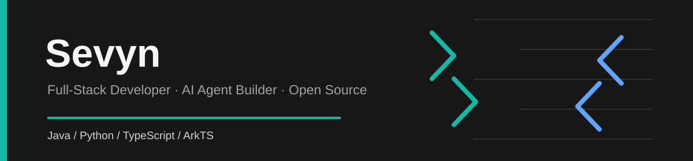

  

  <a href="https://github.com/zqaini002?tab=repositories">Repositories</a>
  &nbsp;|&nbsp;
  <a href="https://github.com/zqaini002?tab=followers">Followers</a>
  &nbsp;|&nbsp;
  <a href="https://github.com/zqaini002">GitHub Profile</a>

## About

I am a full-stack developer interested in building practical, maintainable software systems. My current focus is on AI agent platforms, HarmonyOS applications, and cloud-native backend engineering.

- I enjoy turning complex product requirements into clear, scalable implementation plans.
- I work across Java, Python, TypeScript, and the surrounding application infrastructure.
- I value readable code, tested behavior, and useful developer tooling.

## Focus Areas

- AI agent runtimes, tool integration, knowledge enhancement, and governance
- Spring Boot services, authentication, data modeling, and business workflows
- HarmonyOS application development with ArkTS
- Python automation and applied AI experiments

## Open Source

<table>
  <tr>
    <td>
      <h3><a href="https://github.com/QoderAI/better-harness">better-harness</a></h3>
      
Developer tooling for safer coding-agent delivery and continuous improvement.

      <code>JavaScript</code> <code>CLI</code> <code>1.3k+ Stars</code>
    </td>
  </tr>
</table>

## Personal Projects

<table>
  <tr>
    <td width="50%" valign="top">
      <h3><a href="https://github.com/zqaini002/Novel_Wonderful-generation">Novel Wonderful Generation</a></h3>
      
Novel analysis for discovery, reading, and deeper content analysis.

      <code>Java</code> <code>46 Stars</code>
    </td>
    <td width="50%" valign="top">
      <h3><a href="https://github.com/zqaini002/student-management">Student Management</a></h3>
      
Information management with authentication, courses, grades, and administration workflows.

      <code>Java</code> <code>Spring Boot</code> <code>9 Stars</code>
    </td>
  </tr>
  <tr>
    <td width="50%" valign="top">
      <h3><a href="https://github.com/zqaini002/YaoYaoLingXian">YaoYaoLingXian</a></h3>
      
A HarmonyOS application for setting, managing, and pursuing personal goals.

      <code>ArkTS</code> <code>HarmonyOS</code> <code>5 Stars</code>
    </td>
    <td width="50%" valign="top">
      <h3><a href="https://github.com/zqaini002/weix">weix</a></h3>
      
A personal messaging automation experiment with LLM-powered replies and configurable skills.

      <code>Python</code> <code>3 Stars</code>
    </td>
  </tr>
  <tr>
    <td width="50%" valign="top">
      <h3><a href="https://github.com/zqaini002/AI-Agent-Harness">AI Agent Harness</a></h3>
      
A deployable platform for agent orchestration, knowledge enhancement, tools, and governance.

      <code>Java</code> <code>2 Stars</code>
    </td>
    <td width="50%" valign="top">
      <h3><a href="https://github.com/zqaini002/Travel-Assistant">Travel Assistant</a></h3>
      
A voice-driven travel planning assistant built on Open-AutoGLM.

      <code>Python</code> <code>1 Star</code>
    </td>
  </tr>
</table>

## Technology

| Area | Tools and Languages |
| --- | --- |
| Backend | Java, Spring Boot, Spring Security, MyBatis-Plus, MySQL, Redis |
| AI and Automation | Python, PyTorch, LLM applications, agent workflows |
| Web | TypeScript, JavaScript, Vue, React, Node.js |
| Platform and Delivery | ArkTS, HarmonyOS, Docker, Linux, Git |

  Thanks for visiting. Explore my <a href="https://github.com/zqaini002?tab=repositories">repositories</a> to see the work in more detail.

