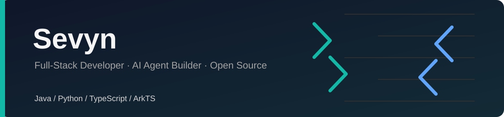
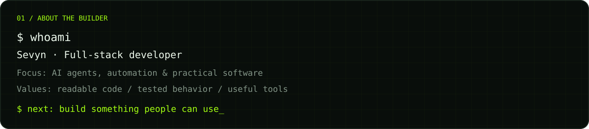
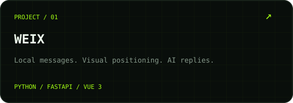
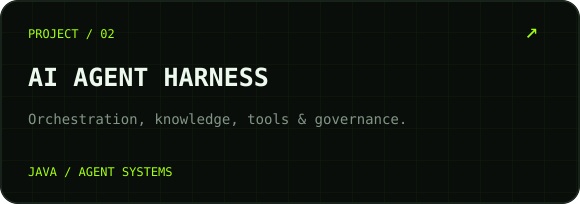
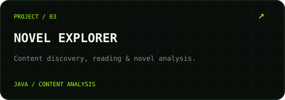
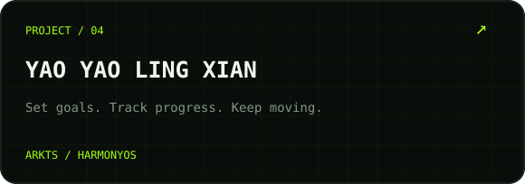
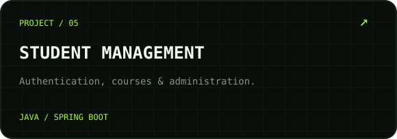
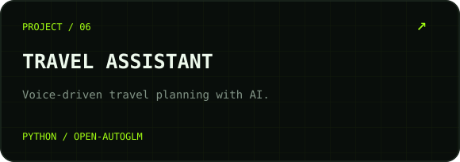
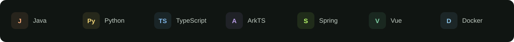

<b>让想法落地，让系统跑起来。</b> AI Agent · 全栈应用 · 自动化工具

  
  
  

我是 **Sevyn**，关注 AI Agent、全栈应用和自动化工具。喜欢把复杂需求拆成清晰的流程，把想法做成可以实际使用的软件。

## `02 / SELECTED PROJECTS`

<table>
  <tr>
    <td width="50%" valign="top">
       
      
    </td>
    <td width="50%" valign="top">
       
      
    </td>
  </tr>
  <tr>
    <td width="50%" valign="top">
       
      
    </td>
    <td width="50%" valign="top">
       
      
    </td>
  </tr>
  <tr>
    <td width="50%" valign="top">
       
      
    </td>
    <td width="50%" valign="top">
       
      
    </td>
  </tr>
</table>

### 当前进展 · Weix

**2026-09-30**：Windows 微信 4.1.15.13 的本机数据库密钥恢复、视觉定位和发送回读已验证；两个私聊交替三轮，6 条消息均回读到正确会话。macOS 已同步代码，界面流程待实机验收。

[文档与功能](https://github.com/zqaini002/weix#readme) · [下载自动构建](https://github.com/zqaini002/weix/releases) · [反馈问题](https://github.com/zqaini002/weix/issues)

**Open-source workspace** · [better-harness](https://github.com/QoderAI/better-harness) — Coding Agent 开发工具与交付流程。

## `04 / CONTRIBUTION GRID`

> Keep building. Keep learning. Keep moving.

<picture>
  <source media="(prefers-color-scheme: dark)" srcset="https://raw.githubusercontent.com/zqaini002/zqaini002/output/github-snake-dark.svg" />
  <source media="(prefers-color-scheme: light)" srcset="https://raw.githubusercontent.com/zqaini002/zqaini002/output/github-snake.svg" />
  
</picture>

<code>[ END OF TRANSMISSION ]</code> <a href="https://github.com/zqaini002?tab=repositories">Explore the next project →</a>

Star 与关注人数使用动态徽章，可能存在缓存延迟。
